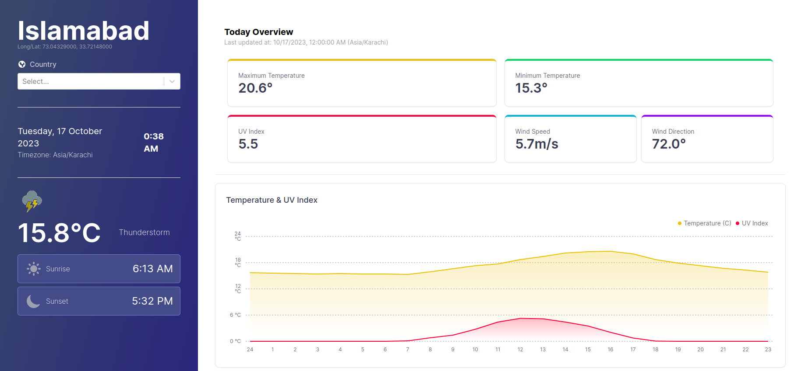
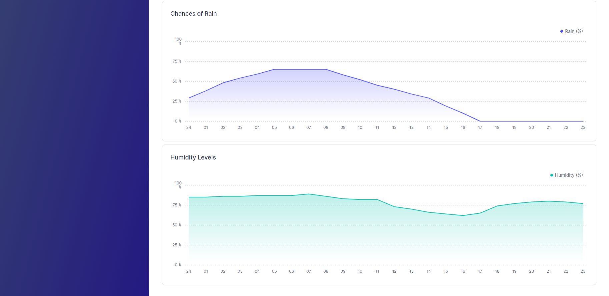

# WeatherApp

WeatherApp is a web application that provides real-time weather updates for any location. Utilizing the OpenMeteo Weather API, it delivers accurate weather data including temperature, humidity, wind speed, and more, all in a user-friendly interface.





## Features

- Real-time weather updates.
- Search weather by city, latitude, and longitude.
- Detailed weather metrics including temperature, humidity, wind speed, and UV index.
- Responsive design for desktop and mobile browsers.
- Modern and intuitive user interface.

## Project Structure

The project is divided into two main directories:

- `frontend`: Contains the Next.js application.
- `backend`: Contains the Flask application.

## Getting Started

These instructions will guide you on how to get a copy of the project up and running on your local machine for development and testing purposes.

### Prerequisites

- Node.js
- Python
- npm or Yarn

### Installation

1. Clone the repository:
```bash
git clone https://github.com/MunemHashmi/weatherApp.git
```

2. Navigate to the project directory:
```bash
cd WeatherApp
```

#### Frontend

1. Navigate to the frontend directory:
```bash
cd frontend
```

2. Install dependencies:
```bash
npm install
# or
yarn install
```

3. Start the development server:
```bash
npm run dev
# or
yarn dev
```

Now you can open [http://localhost:3000](http://localhost:3000) to view the app in the browser.

#### Backend

1. Navigate to the backend directory:
```bash
cd backend
```

2. Create a virtual environment and activate it:
```bash
python -m venv env
source env/bin/activate

3. Install dependencies:
```bash
pip install -r requirements.txt
```

4. Start the Flask server:
```bash
flask run
```

The backend server will start on [http://localhost:5000](http://localhost:5000).

## Technology Stack

- Frontend: Next.js
- Backend: Flask
- CSS Framework: Tailwind CSS
- API: OpenMeteo Weather API

## License

WeatherApp is licensed under the MIT License - see the [LICENSE](LICENSE) file for details.

## Acknowledgments

- Weather data provided by OpenMeteo Weather API.
- Icons provided by Heroicons.